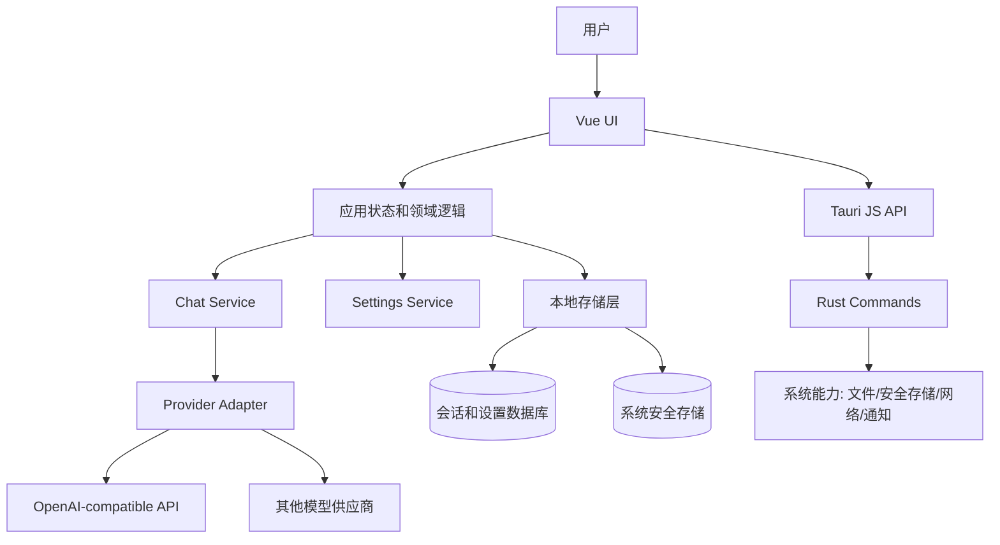
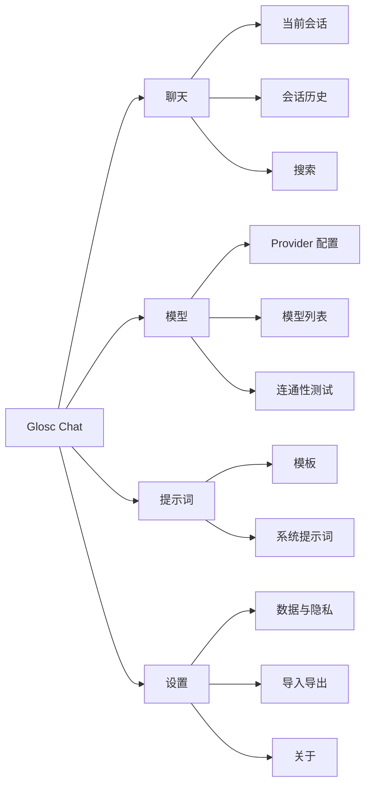
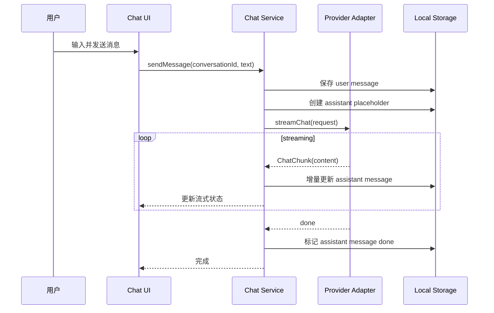

# Glosc Chat 设计文档

## 1. 设计目标

Glosc Chat 的设计目标是构建一个移动端优先、本地优先、可扩展的 AI 会话客户端。设计上参考 open-webui 的成熟产品能力，但不复制其多人自托管 Web 平台形态。

核心目标：

- 支持用户自行接入多个模型供应商。
- 在 UI 上提供一致的聊天、模型选择和历史管理体验。
- 在技术上隔离 UI、会话状态、Provider 适配、存储和原生能力。
- 为知识库、工具调用、插件和同步预留扩展点。
- 保证 API Key 和会话内容的隐私边界清晰。

## 2. 设计参考与取舍

open-webui 值得参考的方向：

- 统一多模型入口。
- 会话、模型、知识库、工具和设置的清晰分区。
- 面向 OpenAI-compatible API 的兼容思路。
- RAG 和工具调用作为高级能力，而不是阻塞基础聊天的前置条件。

Glosc Chat 的取舍：

- 优先个人移动端体验，而不是多人管理后台。
- 优先本地配置和本地数据，而不是服务端数据库。
- 优先 Provider 适配器和安全存储，而不是完整插件市场。
- 优先稳定聊天闭环，而不是一次性实现全部高级功能。

## 3. 总体架构



### 3.1 层级说明

| 层级 | 职责 |
| --- | --- |
| UI 层 | 渲染页面和组件，处理用户交互，不直接拼接供应商请求 |
| 状态层 | 管理会话、设置、加载状态、错误状态 |
| 服务层 | 执行业务动作，例如发送消息、创建会话、保存配置 |
| Provider 适配层 | 屏蔽不同模型 API 的请求和响应差异 |
| 存储层 | 保存会话、消息、设置、模型元数据和迁移版本 |
| Tauri/Rust 层 | 处理安全存储、文件系统、系统集成和必要的网络代理 |

## 4. 推荐目录结构

当前仓库仍是模板结构，建议后续演进为：

```text
src/
  app/
    AppShell.vue
    routes.ts
  assets/
  components/
    chat/
    common/
    settings/
  domain/
    chat.ts
    model.ts
    provider.ts
    settings.ts
  services/
    chatService.ts
    providerRegistry.ts
    settingsService.ts
    storageService.ts
  providers/
    openaiCompatible.ts
    anthropic.ts
    gemini.ts
  stores/
    chatStore.ts
    settingsStore.ts
  storage/
    migrations.ts
    repositories/
  styles/
  utils/
src-tauri/
  src/
    commands/
    secrets/
    storage/
    network/
```

目录原则：

- `components/` 只放可复用 UI。
- `domain/` 只放类型、枚举和纯领域规则。
- `services/` 组织业务流程。
- `providers/` 处理外部模型 API 差异。
- `stores/` 管理响应式状态。
- `storage/` 负责持久化、迁移和查询。

## 5. 产品信息架构



移动端建议：

- 底部导航保留 `聊天`、`模型`、`设置` 三个一级入口。
- 会话历史使用抽屉或单独页面，避免挤占聊天正文。
- 模型选择器必须在聊天输入区附近可见，但不应打断输入。
- 长按消息提供复制、重试、删除、引用、导出等操作。

桌面端建议：

- 左侧为会话列表。
- 中间为聊天正文。
- 右侧按需打开模型参数和会话信息。

## 6. 核心数据模型

以下是建议的 TypeScript 领域模型，实际实现可以根据存储方案调整。

```ts
export type ProviderType =
  | "openai-compatible"
  | "anthropic"
  | "gemini"
  | "custom";

export interface ProviderConfig {
  id: string;
  name: string;
  type: ProviderType;
  baseUrl: string;
  apiKeyRef: string;
  enabled: boolean;
  createdAt: string;
  updatedAt: string;
}

export interface ModelConfig {
  id: string;
  providerId: string;
  name: string;
  displayName?: string;
  supportsStreaming: boolean;
  supportsVision: boolean;
  supportsTools: boolean;
  contextWindow?: number;
  defaultParameters: ModelParameters;
}

export interface ModelParameters {
  temperature?: number;
  topP?: number;
  maxTokens?: number;
  presencePenalty?: number;
  frequencyPenalty?: number;
}

export interface Conversation {
  id: string;
  title: string;
  providerId: string;
  modelId: string;
  systemPrompt?: string;
  pinned: boolean;
  archived: boolean;
  createdAt: string;
  updatedAt: string;
}

export type MessageRole = "system" | "user" | "assistant" | "tool";

export interface ChatMessage {
  id: string;
  conversationId: string;
  role: MessageRole;
  content: string;
  attachments?: MessageAttachment[];
  status: "pending" | "streaming" | "done" | "failed" | "cancelled";
  errorCode?: string;
  createdAt: string;
  updatedAt: string;
}

export interface MessageAttachment {
  id: string;
  name: string;
  mimeType: string;
  size: number;
  kind: "text" | "image";
  dataUrl?: string;
  createdAt: string;
}
```

## 7. Provider 适配设计

Provider 适配层是核心边界。UI 和业务服务只依赖统一接口，不直接依赖具体供应商。

```ts
export interface ChatProvider {
  id: string;
  type: ProviderType;
  testConnection(config: ProviderConfig): Promise<ProviderHealth>;
  listModels(config: ProviderConfig): Promise<ModelConfig[]>;
  streamChat(request: ChatRequest): AsyncIterable<ChatChunk>;
}

export interface ChatRequest {
  provider: ProviderConfig;
  model: ModelConfig;
  messages: ChatMessage[];
  parameters: ModelParameters;
  abortSignal?: AbortSignal;
}

export interface ChatChunk {
  type: "content" | "tool-call" | "done" | "error";
  text?: string;
  error?: ProviderError;
}
```

### 7.1 MVP 适配优先级

1. OpenAI-compatible：覆盖 OpenAI、兼容网关和大量第三方模型服务。
2. Anthropic：使用 `/v1/messages` 和 Anthropic SSE 事件。
3. Gemini：使用 `streamGenerateContent?alt=sse` 和 Gemini inline data。
4. 自定义 Provider：允许用户手动配置 header、路径和模型名。

### 7.2 错误映射

所有供应商错误应映射为统一错误类型：

| 错误码 | 场景 | 用户操作 |
| --- | --- | --- |
| `auth.invalid_key` | API Key 无效 | 编辑 Provider |
| `auth.forbidden` | Key 无权限或模型不可用 | 检查权限和模型 |
| `network.unreachable` | 网络不可达 | 重试或切换网络 |
| `rate_limited` | 请求限流 | 稍后重试 |
| `model.not_found` | 模型名错误 | 修改模型配置 |
| `stream.interrupted` | 流式响应中断 | 重试生成 |
| `unknown` | 未识别错误 | 复制错误详情 |

## 8. 聊天流程设计



### 8.1 中断和重试

- 每次请求必须绑定 `AbortController`。
- 用户点击停止时，将助手消息标记为 `cancelled` 并保存已生成内容。
- 重试时复用上一条用户消息，并创建新的助手消息。
- 如果请求失败，用户消息不删除，助手消息标记为 `failed`。

### 8.2 上下文策略

MVP 可以先使用最近 N 条消息作为上下文。后续需要加入：

- 按模型上下文窗口裁剪。
- 对长会话做摘要。
- 对附件和知识库引用做单独预算。
- 在请求前显示预计 token 或上下文风险提示。

## 9. 存储设计

### 9.1 存储分类

| 数据 | 推荐存储 | 说明 |
| --- | --- | --- |
| API Key | 系统安全存储 | 不进入普通数据库和日志 |
| Provider 配置 | 本地数据库 | `apiKeyRef` 指向安全存储 |
| 会话 | 本地数据库 | 可导出 |
| 消息 | 本地数据库 | 支持分页加载 |
| 附件 | 应用数据目录 | 数据库保存元信息 |
| 用户偏好 | 本地数据库或简单配置 | 主题、默认模型等 |

### 9.2 MVP 存储方案

可选路线：

1. 前端 IndexedDB + Tauri 安全存储插件。
2. Rust SQLite + Tauri command 查询。
3. 前端状态 + 文件 JSON，仅用于早期原型，不建议进入正式版本。

推荐正式路线是 Rust SQLite + 系统安全存储。这样可以更好地支持移动端、备份、迁移和隐私边界。

### 9.3 迁移原则

- 每个 schema 版本都要有向前迁移脚本。
- 启动时检查数据库版本并迁移。
- 迁移失败时保留原始文件，不覆盖用户数据。
- 导出文件必须包含 schema version。

## 10. 安全设计

### 10.1 密钥保护

- API Key 不应进入 Vue 响应式状态的可持久化快照。
- API Key 不应写入 localStorage、普通日志、错误上报或导出文件。
- Provider 配置中只保存 `apiKeyRef`。
- Rust 层通过系统安全存储读写真实 API Key。

### 10.2 网络请求边界

两种实现选择：

| 方案 | 优点 | 缺点 |
| --- | --- | --- |
| 前端直接 fetch | 实现快，调试简单 | API Key 暴露在 JS 运行时，CORS 可能受限 |
| Rust 网络代理 | 更适合密钥保护和移动端 | 实现复杂，需要设计流式桥接 |

MVP 原型可用前端直接 fetch，但进入发布版本前应迁移到 Rust 网络代理或确保密钥保护方案完整。

### 10.3 CSP 和窗口安全

当前 `tauri.conf.json` 已配置 CSP。发布前继续按实际 Provider 域名收紧：

- `default-src`
- `connect-src`
- `img-src`
- `style-src`
- `script-src`

同时应限制外部链接打开行为，避免任意 URL 在应用内执行。

### 10.4 日志脱敏

日志记录应保留：

- Provider 类型。
- HTTP 状态码。
- 错误码。
- 请求耗时。

日志不得保留：

- API Key。
- Authorization Header。
- 完整用户消息。
- 完整模型响应。

## 11. UI 设计规范

### 11.1 移动端聊天界面

- 顶部显示会话标题和模型选择入口。
- 中部为消息流，支持增量渲染和滚动到底部。
- 底部为输入框、附件按钮、发送/停止按钮。
- 输入框聚焦时适配软键盘和安全区。
- 生成中时发送按钮变为停止按钮。
- 消息操作通过长按或更多菜单展示。

### 11.2 状态设计

| 状态 | UI 表现 |
| --- | --- |
| 空会话 | 显示输入区和少量快捷提示词 |
| 无 Provider | 引导添加模型配置 |
| 生成中 | 展示流式内容、停止按钮和轻量 loading |
| 请求失败 | 在失败消息上显示错误摘要和重试 |
| 离线 | 禁用发送，保留输入 |
| API Key 失效 | 跳转 Provider 编辑入口 |

### 11.3 可访问性

- 所有按钮提供可读标签。
- 支持系统深浅色。
- 代码块支持横向滚动和复制。
- 文本不依赖颜色单独表达状态。
- 输入框、菜单和弹窗可通过键盘操作。

## 12. 知识库/RAG 预留设计

知识库不进入 MVP，但需要预留接口：

```ts
export interface KnowledgeSource {
  id: string;
  name: string;
  type: "file" | "url" | "note";
  status: "indexing" | "ready" | "failed";
  createdAt: string;
  updatedAt: string;
}

export interface RetrievalResult {
  sourceId: string;
  title: string;
  snippet: string;
  score: number;
  metadata?: Record<string, unknown>;
}
```

未来流程：

1. 用户导入文档。
2. 应用提取文本并分块。
3. 使用嵌入模型生成向量。
4. 本地或远程向量索引保存。
5. 聊天前按问题检索相关片段。
6. 请求模型时附带引用片段。
7. 回复中展示来源引用。

## 13. 工具调用预留设计

工具调用用于让模型访问受控能力，例如搜索、天气、文件摘要或本地任务。

```ts
export interface ToolDefinition {
  id: string;
  name: string;
  description: string;
  inputSchema: Record<string, unknown>;
  enabled: boolean;
}

export interface ToolInvocation {
  id: string;
  toolId: string;
  arguments: Record<string, unknown>;
  status: "pending" | "running" | "done" | "failed";
  result?: unknown;
  error?: string;
}
```

工具设计原则：

- 默认关闭高风险工具。
- 每次执行涉及网络、文件或系统操作的工具前，需要用户授权或明确设置。
- 工具结果进入会话时应标记来源。
- 工具定义和执行日志需要可审计。

## 14. 同步设计预留

同步不是 MVP 必需能力。后续可选路线：

| 方案 | 适用场景 | 注意事项 |
| --- | --- | --- |
| 文件导入导出 | 手动备份 | 简单可靠，但不自动 |
| WebDAV | 高级用户 | 需要冲突解决 |
| iCloud/系统云 | iOS 用户 | 平台绑定 |
| 私有后端 | 团队或多端 | 需要账号、安全和成本 |

同步必须满足：

- API Key 默认不进入同步文件。
- 会话内容同步前提示隐私风险。
- 冲突处理必须可解释，不静默覆盖。

## 15. 测试设计

| 测试类型 | 覆盖内容 |
| --- | --- |
| 单元测试 | Provider 错误映射、消息序列化、上下文裁剪 |
| 组件测试 | 输入框、消息渲染、模型选择、错误状态 |
| 集成测试 | 从发送消息到保存历史的完整流程 |
| Tauri 测试 | Rust 命令、安全存储、文件读写 |
| 手动验收 | 移动端键盘、安全区、深浅色、网络异常 |

优先为以下逻辑添加测试：

- API Key 不进入导出文件。
- 流式响应中断后消息状态正确。
- Provider 配置变更不破坏历史会话。
- 长会话裁剪不会删除原始历史记录。

## 16. 发布前设计检查清单

- 模板 UI 已替换为真实聊天界面。
- Provider 适配层和 UI 解耦。
- API Key 使用安全存储。
- CSP 已配置并需在发布前按 Provider 白名单收紧。
- 失败状态可恢复。
- 会话数据可以导出和恢复。
- 桌面和移动端布局分别验证。
- open-webui 参考能力已按移动端场景取舍，而不是简单照搬。
